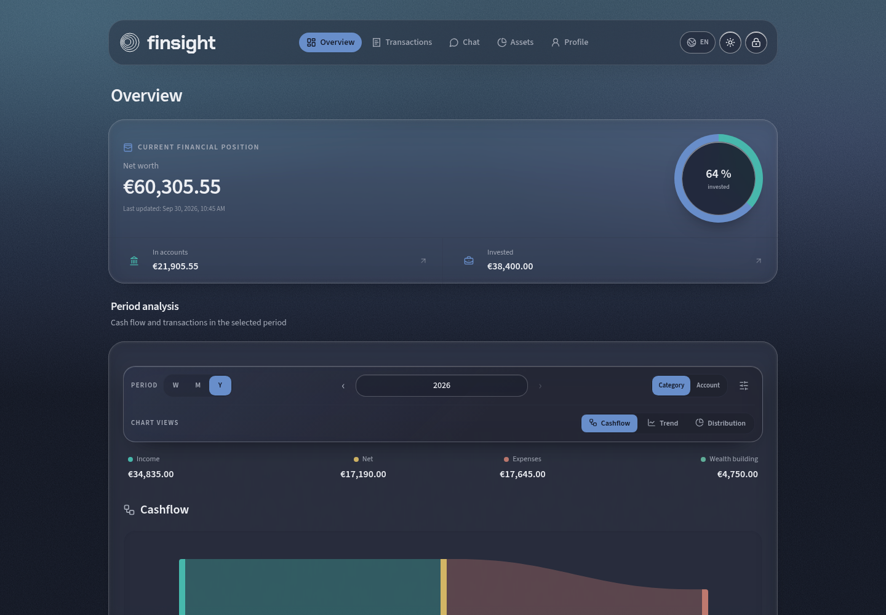
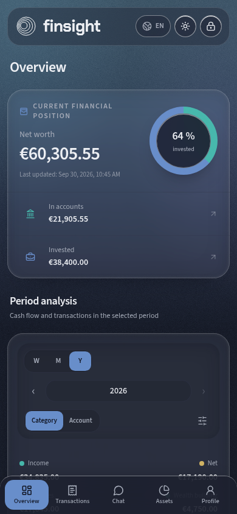
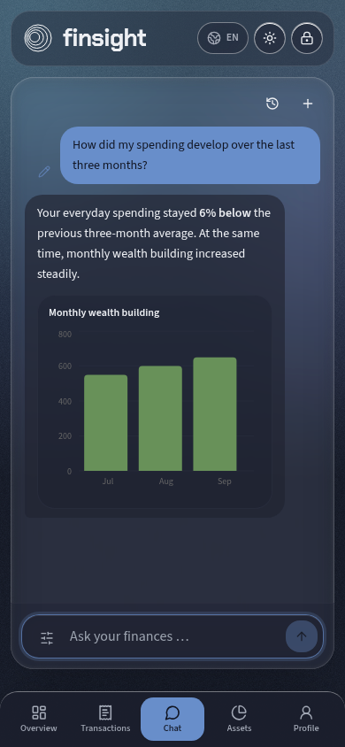
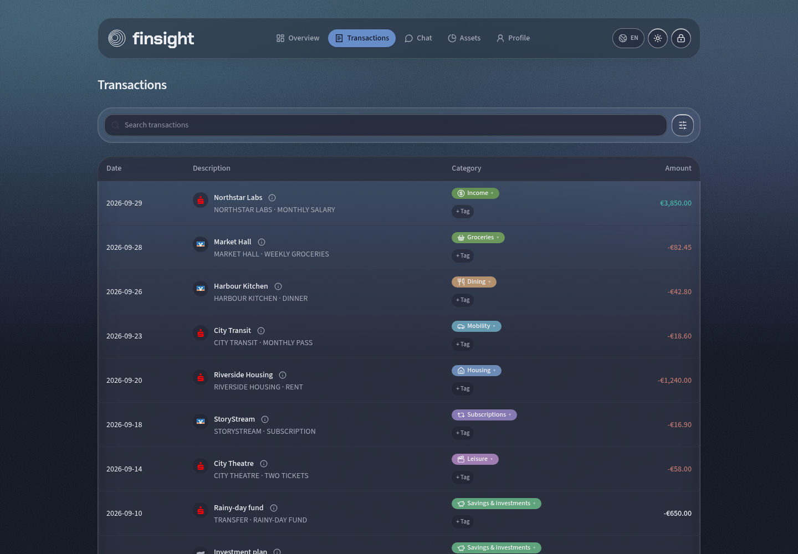
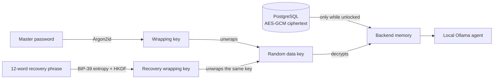

<picture>
  <source media="(prefers-color-scheme: dark)" srcset="docs/assets/finsight-eye-dark.svg">
  
</picture>

[](https://github.com/hurlerml/finsight/actions/workflows/ci.yml)

**Insight-first finance. Your finances should be private — and stay private.**

finsight grew from a simple frustration: my financial activity was spread
across bank accounts, neobrokers and crypto platforms. Cloud products such as
[Finanzfluss Copilot](https://www.finanzfluss.de/copilot/),
[Parqet](https://parqet.com/) and [getquin](https://www.getquin.com/) already
provide that kind of overview. They are convenient, but the combined financial
picture still lives on someone else's servers. I did not want to hand that much
personal data to a single platform.

I wanted a self-hosted application that would keep me in control without giving
up a polished interface or useful AI. Local models are already capable of
categorizing transactions and answering questions about them on a machine at
home. finsight is built around that idea: a local agent categorizes
transactions, identifies transfers between accounts and lets you explore your
finances through conversation, calculations and charts. By default, financial
context goes to your own Ollama instance instead of a hosted assistant such as
ChatGPT.

This is an early prototype, built with Codex and ChatGPT while experimenting
with remote development from a phone. Parts of the generated code have not been
reviewed in detail. Expect bugs, incomplete integrations and potentially
incorrect results. finsight has not been independently audited and does not
provide financial advice.

> [!WARNING]
> finsight is a single-user application intended for local use or access through
> a private VPN only. Do **not** expose it directly to the public internet, open
> its ports on your router, or place it behind a publicly reachable reverse proxy
> or domain. For remote access, use a private network such as Tailscale or
> WireGuard and restrict access to trusted devices.

[Features](#features) · [Getting started](#getting-started) · [Adapters](#supported-adapters) · [Credentials](#credentials-and-secrets) · [Privacy](#privacy) · [Development](#development) · [Related projects](#related-projects)

## A private finance workspace on every screen

<table>
  <tr>
    <td colspan="2" align="center">
      <a href="docs/screenshots/overview-desktop-dark.png">
        
      </a>
      <br><sub><strong>Overview</strong> · current net worth and cashflow analysis</sub>
    </td>
  </tr>
  <tr>
    <td width="50%" align="center" valign="top">
      <a href="docs/screenshots/overview-mobile-dark.png">
        
      </a>
      <br><sub><strong>Mobile overview</strong> · app-like navigation and touch-friendly charts</sub>
    </td>
    <td width="50%" align="center" valign="top">
      <a href="docs/screenshots/chat-mobile-dark.png">
        
      </a>
      <br><sub><strong>Local finance chat</strong> · explanations, calculations and generated charts</sub>
    </td>
  </tr>
  <tr>
    <td colspan="2" align="center">
      <a href="docs/screenshots/transactions-desktop-dark.png">
        
      </a>
      <br><sub><strong>Transactions</strong> · accounts, categories and local AI explanations in one place</sub>
    </td>
  </tr>
</table>

The responsive interface is designed to feel at home on a phone, including a
mobile navigation dock, touch-friendly charts and the same local finance chat.
Every value and booking shown above comes from the repository's deterministic
[screenshot fixtures](docs/screenshots/README.md), not from a real account. Click
any tile to open the original image.

## Features

- **Automatic categorization:** local AI, editable categories, tags and transfer
  detection across your accounts.
- **Talk to your finances:** local chat with transaction search, semantic search,
  exact calculations, charts and conversation history.
- **See the bigger picture:** charts for cashflow, spending trends, investments and P&L.
- **Connect your accounts:** searchable German FinTS bank directory,
  Trade Republic (unofficial integration), Binance, Trading 212 and Coinbase.
- **Keep control:** encrypted financial records, chat and embeddings; a responsive
  English/German interface with a presentation mode.

## Getting started

finsight is currently intended for **macOS and Linux**. Both platforms require
[Docker with Compose](https://docs.docker.com/get-started/get-docker/),
[Git](https://git-scm.com/downloads) and a local
[Ollama](https://ollama.com/download) installation. Start Ollama before opening
the first-run assistant. On macOS, installing and opening the Ollama app is the
simplest option; on Linux, follow Ollama's native installation instructions.

Windows may work with Docker Desktop and the Ollama Windows app, but it has not
been tested and is not currently supported.

### 1. Get the project

```bash
git clone https://github.com/hurlerml/finsight.git
cd finsight
cp .env.example .env
```

Set your own URL-safe `POSTGRES_PASSWORD` in `.env` (for example, a long random
hexadecimal string). Keep this file private.

#### Optional: configure FinTS for German banks

Do this **before starting the containers** if you want to connect a German bank
through FinTS. Register your own application product ID at
[fints.org](https://www.fints.org/) and add it to the local `.env` file:

```dotenv
FINTS_PRODUCT_ID=your_registered_product_id
```

The product ID identifies the client application, not your bank account. Keep
your value private and do not commit `.env`. Registration may take several days
or weeks; FinTS synchronization cannot work without a valid product ID.

A shared product ID registered for finsight is planned, but it is not available
yet. Current releases deliberately include no fallback, test or third-party
product ID. Skip this step only if you do not intend to use a FinTS bank.

### 2. Start finsight

```bash
docker compose up --build -d
```

Open [localhost](http://localhost). On the first visit, finsight guides you
through the complete setup:

1. Create the encrypted vault with a master password. Write down the one-time
   12-word recovery phrase and confirm it before continuing.
2. Choose the local Ollama chat model. Installed models are detected
   automatically; **Use another Ollama model** accepts an exact model name when
   the desired model is not installed yet. Missing selected models are queued
   for download through Ollama and their progress is shown in the interface.
3. Decide whether automatic merchant research may use web search for uncertain
   categorizations.
4. Optionally connect and synchronize the first account. More connections can
   be added later under **Accounts**.
5. Review the initial transaction categories and finish onboarding.

For an **Apple Silicon Mac**, the built-in defaults are:

```text
gemma4:26b-mlx          chat and agent tools, about 18 GB
qwen3-embedding:4b      semantic search, about 2.5 GB
```

The MLX chat model is optimized for Apple Silicon. Its weights are about 18 GB;
24 GB unified memory is a practical minimum and 32 GB or more is recommended
for comfortable use alongside Docker and the embedding model. On Linux,
non-Apple hardware or a smaller Mac, select a compatible tool-capable chat model
that fits the available memory instead of the MLX default. The embedding model
can be changed later under **Settings → AI & language models**.

`OLLAMA_MODEL` and `OLLAMA_EMBEDDING_MODEL` in `.env` define these initial
defaults if you want to change them before first launch. Onboarding and Settings
store the later selection inside the encrypted vault. Downloads happen in the
background, so the rest of the interface remains usable while Ollama is working.

See [adapter setup](docs/adapters.md) for provider-specific details.

Stop the stack with `docker compose down`.

When your phone or another computer is on the same trusted local network, it can
connect directly to the machine running finsight. For remote access from outside
that network, use a private VPN such as [Tailscale](https://tailscale.com/) or
WireGuard. Never use router port forwarding or expose the application through a
public reverse proxy, public domain or other internet-facing endpoint.

## Supported adapters

| Source             | Status                                                                                                                                                                                                                                                                                                                                                   | Imported data                                                                      |
| ------------------ | -------------------------------------------------------------------------------------------------------------------------------------------------------------------------------------------------------------------------------------------------------------------------------------------------------------------------------------------------------- | ---------------------------------------------------------------------------------- |
| **FinTS**          | Uses the internal HBCI4Java Spring service for the searchable German bank directory and read-only synchronization. Availability still depends on the selected bank's FinTS service and authentication method.                                                                                                                                            | Accounts, balances and transactions; read-only.                                    |
| **Trade Republic** | **Unofficial and experimental.** The read-only adapter talks to Trade Republic's undocumented web protocol directly. Its protocol handling was informed by the MIT-licensed [`pytr`](https://github.com/pytr-org/pytr) project; `pytr` is not bundled as a runtime dependency. Neither integration is provided, endorsed or supported by Trade Republic. | Cash transactions, portfolio positions and available performance history.          |
| **Binance**        | Uses Binance's documented REST API with a dedicated read-only API key. Trading and withdrawals must remain disabled.                                                                                                                                                                                                                                     | Balances, spot trades, supported history and reconstructed position performance.   |
| **Trading 212**    | Uses the official Public API in read-only mode. The API is currently beta and supports Invest and Stocks ISA accounts.                                                                                                                                                                                                                                   | Cash balance and movements, positions, cost basis and execution history.           |
| **Coinbase**       | Uses the official Advanced Trade REST API over `httpx` with Coinbase's documented CDP JWT authentication and a view-only API key.                                                                                                                                                                                                                        | Fiat balance, portfolio breakdown, EUR spot fills and supported EUR price history. |

## Credentials and secrets

Keep secrets out of the repository. `.env.example` contains placeholders only;
copy it to the gitignored `.env` file and verify that Git ignores it:

```bash
git check-ignore -v .env
```

Only two sensitive setup values belong in `.env`: replace `POSTGRES_PASSWORD`
with a long random value, and set your private `FINTS_PRODUCT_ID` if you use a
German FinTS bank. Do not commit either value.

Master passwords, recovery phrases and provider credentials are entered through
the application, not through environment variables. Connected-account secrets
are stored as encrypted vault data. Use read-only broker and exchange API keys
with the narrowest available permissions; see [adapter setup](docs/adapters.md)
for provider-specific details. Never paste real credentials or financial logs
into GitHub issues.

## Privacy



- **At rest:** credentials, transactions, balances, investments, chat history,
  tags and embeddings are stored as authenticated AES-GCM ciphertext.
- **On unlock:** the master password derives a wrapping key with Argon2id. It
  unwraps the random data key; the master password itself is not stored.
- **On recovery:** a locally generated 12-word BIP-39 phrase derives a separate
  recovery wrapping key. Resetting the password rewraps the same random data key;
  it does not decrypt and re-encrypt every financial record. The words themselves
  are never written to PostgreSQL or browser storage.
- **While in use:** the backend decrypts only the records it needs and sends
  relevant context to the configured Ollama server.
- **On lock or restart:** the application discards access to the active data key.
  Without either the master password or the recovery phrase, encrypted data is
  unrecoverable. Technical IDs, relationships, timestamps, statuses and blind
  indexes remain visible so the database can operate.

This protects a copied database, not a compromised machine while the vault is
open. See the [security model](SECURITY.md) for the complete limitations.

The agent and embedding model run through your local Ollama instance. Optional
web search is split into two controls:

- **Automatic merchant research** is enabled by default for uncertain
  categorization results and can be disabled under **Settings**.
- **Chat web search** is selected separately for each request in the chat tool
  menu. Disabling automatic research does not silently override the chat choice.

For automatic categorization, the complete transaction stays between the
backend and the configured Ollama instance. The external search provider receives
only a compact merchant query. Amounts, dates, common card descriptors, IBANs,
email addresses, phone numbers and long number sequences are removed. Searches
are skipped completely for bank transfers and incoming payments because their
counterparties are more likely to be private individuals.

In chat, the local model creates the merchant query and the backend applies the
same identifier filters before sending it. This is data minimization, **not a
guarantee of anonymity**: arbitrary text and private names cannot always be
recognized reliably. Disable chat web search for sensitive questions. Search
results return to the local model as supporting evidence; the full conversation
is not sent to the search provider by the web-search tool.

Bank synchronization still contacts the connected providers independently of
these controls. Presentation mode changes displayed numbers but does **not**
anonymize booking text or old chats. Keep `DEBUG_LLM` off when using real data.

## Development

React / TypeScript · FastAPI / Python · PostgreSQL · LangChain / Ollama

```bash
docker compose -f docker-compose-dev.yml up --build
```

The development UI runs at [localhost:5173](http://localhost:5173).
See [CONTRIBUTING.md](CONTRIBUTING.md) for tests and development setup,
[architecture](docs/architecture.md), [API overview](docs/api.md) and
[changelog](CHANGELOG.md) for more detail.

Public screenshots are generated from the real frontend with synthetic API
responses. Regenerate them without a backend or database via:

```bash
docker compose -f docker-compose.screenshots.yml run --build --rm screenshots
```

Possible next steps include financial goals with progress tracking,
recurring-payment and transaction-anomaly detection, and broader currency
support. The current focus is German accounts and EUR-based analysis.

## Related projects

Several mature tools overlap with parts of finsight, and each goes deeper in
its own area than this early prototype.

[Portfolio Performance](https://github.com/portfolio-performance/portfolio) is
a mature local application for investment accounting, including PDF imports
from many German financial institutions.
[Firefly III](https://github.com/firefly-iii/firefly-iii) and
[Actual Budget](https://github.com/actualbudget/actual) focus on transactions
and budgets; [txporter](https://github.com/develff/txporter) can feed German
FinTS accounts into Firefly III.
[Ghostfolio](https://github.com/ghostfolio/ghostfolio) and
[rotki](https://github.com/rotki/rotki) track wealth, with rotki particularly
focused on crypto and local data ownership.
[Doughbox](https://github.com/alxjpzmn/doughbox) imports statements from brokers
including Trade Republic and Trading 212 into a self-hosted portfolio.

The cloud services named above, along with spending apps such as Finanzguru,
address a broader version of the original problem. Self-hosted net-worth
trackers such as [Finanze](https://github.com/finanze/finanze) aggregate bank
data through open-banking providers rather than a local FinTS client. Smaller
GitHub projects use local models to categorize imported statements or
synchronize individual brokers.

Those projects may be a better fit when you need their depth in accounting,
budgeting or portfolio analysis. finsight takes a different, narrower approach:
read-only German FinTS, selected broker and exchange APIs, and a local language
model in one single-user web application.

## License

[MIT](LICENSE). Dependencies and provider logos retain their own licenses and
trademark rights; see [third-party notices](THIRD_PARTY_NOTICES.md).
finsight is not affiliated with the connected financial providers.
